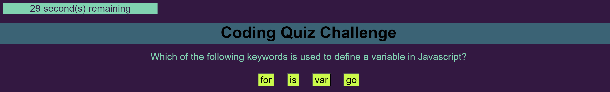
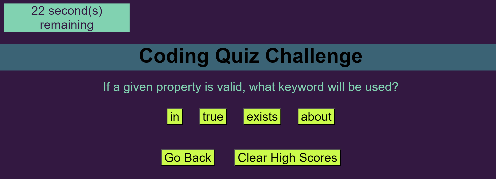
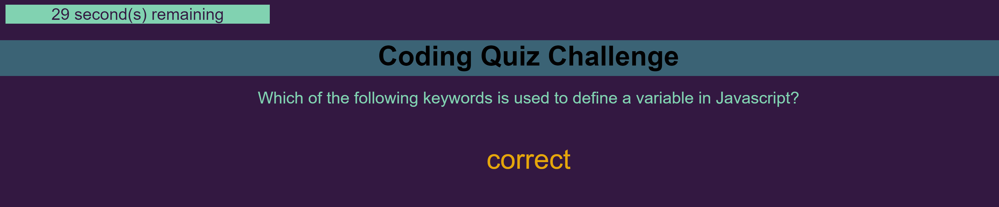
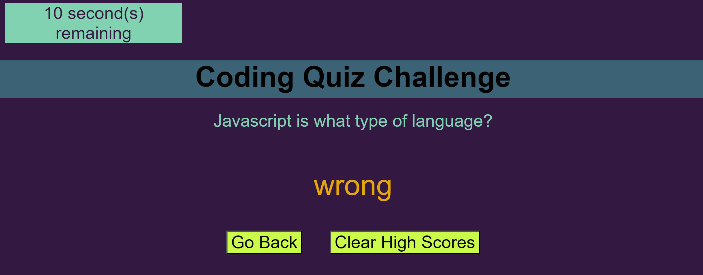
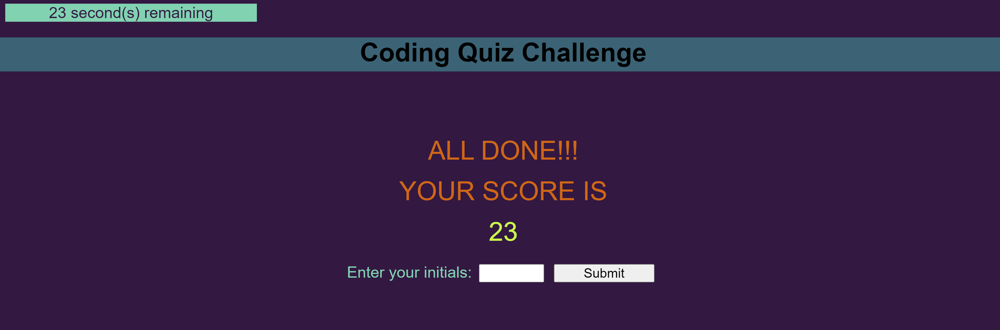
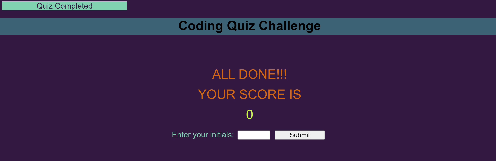

# code-quiz

## Description
  - What you will discover is an app that is a timed quiz with multiple-choice questions. This app will run in the browser and will feature effectively updated HTML and CSS run by JavaScript code. This app will be neat, orderly and responsive to the users interface.

  ### What are the aspects of my website?
    - Timed quiz
    - When the start button is pushed the timer starts.
    - Once a question is answered you will go onto the next question until done.
    - When a question is answered incorrectly time will be subtracted from the clock.
    - When all questions are completed or timer reaches zero the challenge is over.
    - Upon challenge being completed you can save your initials and score.
    - Responsive for all media screen sizes

  - How to make a multiple choice quiz with a variety of different functions. While maintaining the proper responsiveness for the users interface. 

  ### - What you are expected to see on your screen

  * A view of what the start of the quiz will look like
   

  * A look of what quiz in action will look like
    

  * Correct answer response
   

  * Wrong answer response
    

  * Your score upon last question answered
    

  * If the timer reaches 0 before you finish = quiz completed, score 0
  

  * 

## Installation:
  - ### Create a new repo on GitHub
      - Go to the upper right corner and click the + icon to create a New Repository
      - Enter a unique repo name (lower case & no spaces)
      - Select License (basic = MIT License)
      - Click Create Repository 

  - ### Clone the repo to a folder on your machine
      - Navigate to the directory you want to clone
      - git clone https://github.com/url-TO_REPO_HERE
          - git clone command - it copies the repo from github  to your local computer
      - git clone https://github.com/YOUR-USERNAME/YOURREPOSITORY
          - Your command line should respond as below.
          

  - ### Navigation
      - Navigate to the folder in which you cloned your repo
      - Click on index.html file
      - Double click to open file

## Features:
  - Multiple choice quiz
  - A time with 30 seconds will start on the click of the start button
  - A response of correct/wrong after each question is answered
  - Lost time for wrong answer
  - High Scores
  - Clear high scores

## Built with and deployed with:
  - JavaScript
  - HTML
  - CSS
  - Visual Studios Code
  - Git Bash
  - GitHub
  
## Usage:
  - On your machine navigate to the folder you created.
  - Locate the Index.html file in your browser.
  - https://sheila-ha.github.io/code-quiz/
  - https://github.com/Sheila-Ha/code-quiz

## Credits:
The guide used:
 - [Instructions and Starter Code](https://git.bootcampcontent.com/University-of-Minnesota/UofM-VIRT-FSF-PT-10-2023-U-LOLC/-/tree/main/01-HTML-Git-CSS/02-Challenge)
 - [input type=submit](https://developer.mozilla.org/en-US/docs/Web/HTML/Element/input/submit)
 - [Local Storage](https://developer.mozilla.org/en-US/docs/Web/API/Window/localStorage)
 - [Array push](https://www.w3schools.com/jsref/jsref_push.asp)
 - [Array sort](https://developer.mozilla.org/en-US/docs/Web/JavaScript/Reference/Global_Objects/Array/sort)
 - [Array reverse](https://www.w3schools.com/jsref/jsref_reverse.asp)
 - [disable button](https://developer.mozilla.org/en-US/docs/Web/API/Element/setAttribute#examples)
 - [Object](https://developer.mozilla.org/en-US/docs/Web/JavaScript/Reference/Global_Objects/Object#examples)
 - [Working with objects](https://developer.mozilla.org/en-US/docs/Web/JavaScript/Guide/Working_with_Objects#defining_methods)
 - [Loops & iteration](https://developer.mozilla.org/en-US/docs/Web/JavaScript/Guide/Loops_and_iteration#for_statement)
- [Coolers- found color scheme](https://coolors.co/palettes/trending)
- [scoring](https://developer.mozilla.org/en-US/docs/Web/JavaScript/Guide/Grammar_and_types#variable_scope)
- [Display none](https://developer.mozilla.org/en-US/docs/Web/CSS/display)

 

## License:
  - By contributing, you agree that your contribution wil be licensed under its MIT License.